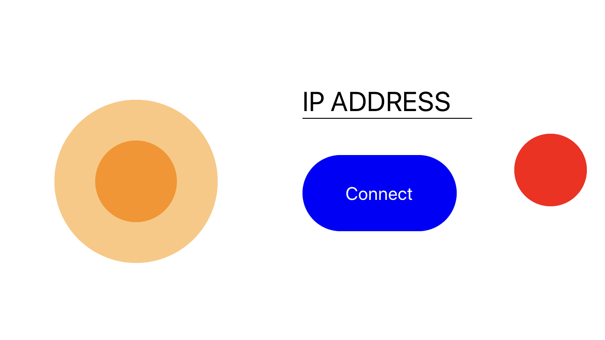

# ros-joy

A simple app built on React Native and ExpoKit to teleoperate ROS robots (using the [rosbridge](http://wiki.ros.org/rosbridge_suite) protocol)

- Sends Twist messages to the /cmd_vel topic
- Communicates with Websocket server at port 8080
- Min/max velocities and angulars are set as constants in `App.js`

### Dependencies

- expo
- expo-multi-touch
- expokit
- react
- react-native

### Build:

- `npm install`
- `cd ios && pod install`

---

